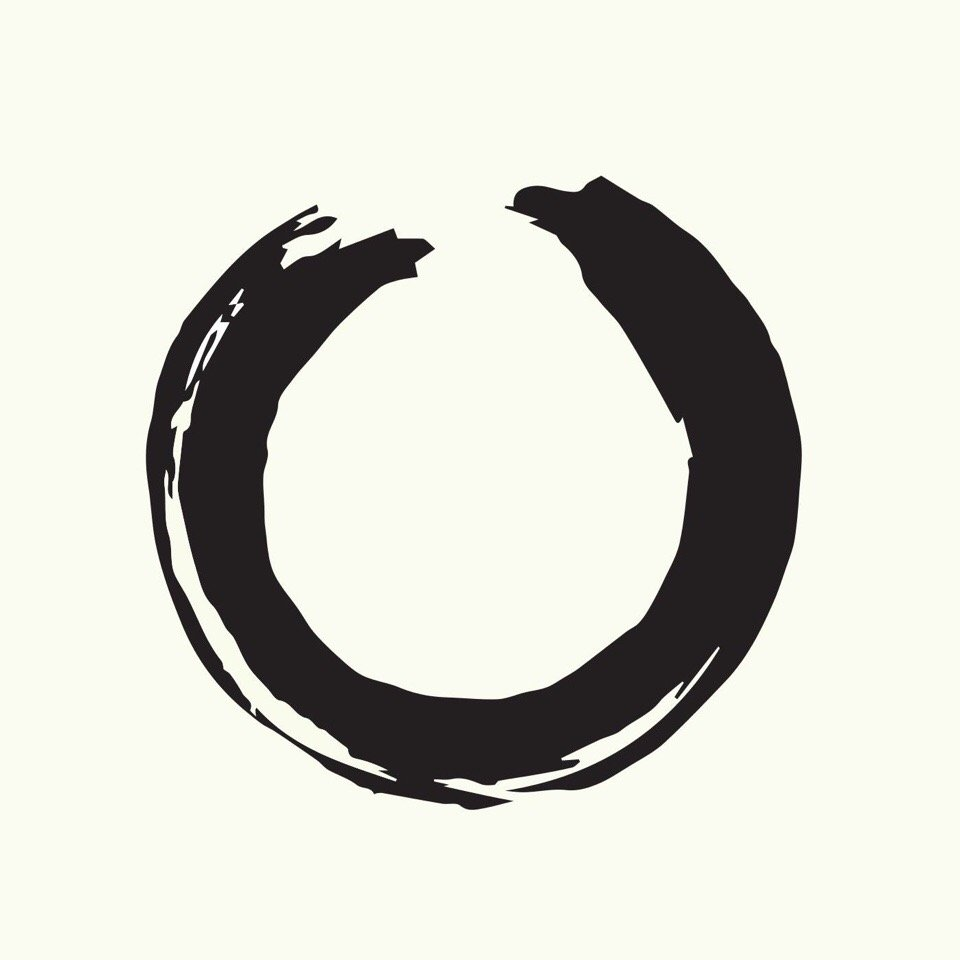

# 张潇雨微博精选 v1.1

### 💬 编者前言 

在[《张潇雨 100 问》](https://pan.baidu.com/s/1HboXmZ7N0rFr66Y45HrODw?pwd=a5ej)开篇，我就写「为了避免字数无限膨胀，我对纯理论的部分进行了删减。纯理论的哲思也很好，只是一种取舍。」这些哲思，我放在这份精选集里。

一共收录 365 段话，内容多来自[张潇雨](https://weibo.com/p/1005051977585731/home)的微博和[《得意忘形》](https://www.xiaoyuzhoufm.com/podcast/5e74543a418a84a046c4e50e)播客。筛选标准参考了微博点赞和转发数、张潇雨转发数，以及标签和内容主题的关联度，当然，少不了我的私人最爱。

我幻想读者随手翻看这些「还未被清晰定义」的短句时，会不经意间给自己种下一颗种子。可能你也想做点儿什么，但总使不上劲儿，没关系，让这些句子「冲刷你、穿过你、流经你。」

直到有一天，你接收到宇宙的信号，一切水到渠成，自然发生。

> Gradually, then Suddenly.——Ernest Hemingway

[涂俊杰](https://nextjs-notion-starter-kit-peach-seven.vercel.app/)

2022-09-17 17:08:05

### 📝 更新日志 

补充了最新微博，去掉了年限制和 tag，减少主题重复的句子，替换了约 ⅓ 的内容。

整体离「不过时」的产品又进了一步 ❤️

2023-12-14 16:04:52\_v1.1（[原 v1.0 版本链接](https://rili.zxy.wiki/v/1.0)）


首发于知识星球「[84000](https://t.zsxq.com/0cjuUrXYj)」，另附 [Notion ](https://tujj.notion.site/bbee96f5bc754e108c4cb5149ea0b8cd)共创版本，可以评论提交你喜欢的句子。


### 一月 

#### 01/01

芒格的意思大概是：如果你还需要别人的认可和允许来做自己想做的事的话，那么也许你还没想清楚自己要做什么。

#### 01/02

想完成一件重要的事，最关键的环节不是什么设立远大目标、学习高效方法或者坚定自身意志，而是把这件事放在一个无可辩驳的最高优先级上——而其他所有事，不管听起来多么正确合理、多么理所应当，都要彻底围绕着这件事来运行，都要进行不可妥协的让步，都要摒弃与自我反复的讨价还价。只有做出这种程度的舍弃与牺牲，重要的结果才有可能到来。

#### 01/03

总要记得火箭是要靠不停脱落一些东西才能飞得更远的🚀。

#### 01/04

道理在初中的时候就学过了：想要打破现有的平衡态，就要对该状态做超出临界点的功。

#### 01/05

几乎所有好的转变的开始都来自于一个行动：离开糟糕的人际关系。

#### 01/06

恪守自己的行进主线，别让社交媒体设置你每天的思考议题。

#### 01/07

你觉得自己应该做但一直不想做的那个事情，在周末、节日、度假、gap year、谈恋爱、度蜜月、分手、离婚、考上理想大学、换个新工作、路边捡到钱、公司 IPO、区块链革命、获诺贝尔奖、经济危机、南极冰融化、小行星撞击地球、宇宙大爆炸......之后很可能还是不会做的。还是向内看看阻碍自己的到底是什么，可能会有一些真正的答案。

#### 01/08

这几年愈发感觉到，作品是我们和世界连接的方式，希望大家新一年都可以创造点什么，哪怕只是很小很小的东西。

#### 01/09

看到一句西方谚语：当学生准备好了，老师就会出现。

#### 01/10

一个人做的事情，时效性越强，起作用的时间就越短；反过来，所谓「没有时效性」的事情，其实是「在你余生中都会起作用」的事情。怎么选不是很显然吗。

#### 01/11

如果你总是认可自己，那么余生皆是假期。

#### 01/12

喜欢做一件事，和做一件事能让你暂时逃避真实的焦虑和烦恼，是两个不同的东西。

#### 01/13

你对抗的东西就会持续，因为你让一个假的东西成真了。

#### 01/14

最近试着在把日常语言系统里的一些「应该」替换成「值得」。比如「你应该换个工作」变成「你值得换个工作」，「你应该去运动和健身」变成「你值得去运动和健身」。

#### 01/15

任何「达到这种状态就永远没问题了」的想象都是幻觉——不管这种状态是拥有很多钱、获得完美的伴侣，还是达到开悟的境界。实际上，如果真的有「完美」，达到这一刻的时候，整个宇宙都会再次大爆炸（可能是比喻，也可能不是）。因为到了完美，世界就「没有地方可去了」，只能归零与重启。无需追求完美的自洽。那一天只会在宇宙的尽头到来。

#### 01/16

春节是你「think big, think deep, think long」的最好时机。花一些功夫，在没有外界催促的情况下好好整理一下自己的生活。虽然陪家人串亲戚吃吃喝喝也很重要，但千万别忘了把一些时间留给自己。

#### 01/17

比起那种「一路披荆斩棘」的 game，我更喜欢的是「全靠同行衬托」。

#### 01/18

做播客的真正初心不是教人怎么造船，而是告诉你：大海是个好东西。

#### 01/19

要给自己设立一个有野心的认知水平成长速度，比如如果每过两三年你没把大部分曾经以为是「老师」的人都抛弃，说明你的速度还不够快（但也不用心急，知道这个事情就好）。因为相信我，大部分人的格局上限其实非常低，那点儿小聪明用个三五年还行，越往后就越只能重复自己，没什么突破然后就自然就停止生长了。我这些年见过太多初看惊艳但是过两年发现仍然在原地踏步的人。Don’t be one of them.

#### 01/20

我总说，如果有一个事老是回到你的生活，你忘掉它一阵它又回来了，你说我要去干一些所谓的正事，然后那东西过一阵又回来了，可能没准那件事就是你应该去干的一件事。

#### 01/21

很多重大问题的解决往往不是它「被解决了」，而是它「不需要再被问了」。

#### 01/22

如果，你也会感觉到，假如自己把一些事情做得更好，就无法避免要与现在身边的人与环境分离，会让更多人不理解你，也可能会变得更孤独一点的话，我可以告诉你，没关系的，大胆去做吧。在更高处、在更远处、在更深处，你还会遇到很多人很多事，但最重要的是，你会遇到真正的自己。这也是我们一生唯一重要的旅程。新一年，敢于伟大。Dare to be Great.

#### 01/23

吃好、睡好、锻炼身体、做自己喜欢的事，人生才刚刚开始。

#### 01/24

我一直认为个人成长与人生选择过程中有三个悖论：16-18 岁在对学科与知识一无所知的时候就被要求选择自己的专业；22-25 岁在对商业世界运行规则毫无概念的时候就被要求选择工作方向；25-28 岁在对自己和人际关系一知半解的情况下就被要求确定长期伴侣；这样想来，其实人生出问题是一个大概率事件。

#### 01/25

人生中绝大部分问题就像一块绢布上的褶皱，你把其他地方展平了，这个褶皱也就自然消失了。而花时间去研究褶皱的颜色、形状和材料学结构，反而是缘木求鱼的。

#### 01/26

我一直觉得对钱的理解——也就是基本的「财商」教育——应该被纳入一个国家的通识教育体系，就像数学、哲学、逻辑学、伦理学、社会学、沟通与表达和写作课等等一样。

#### 01/27

能找到一些有理有据的、总能挑战你认知的、让你有点不舒服的人或物，可能更应该感激，而不是抵触。这也是为什么我总坚持在自己的时间线里放一些和我看法总不一样的人，尽管每次看到还是会有点难受。我也鼓励你这么做。因为学会克服「认知失调」带来的不适感，是人进步的一个关键。

#### 01/28

好的信心往往不是来自于觉得一件事不难，而是不觉得一件事难。对事情不带主观评判之心，把能量用在思考促成它发生的条件是什么、怎样可以做到、具体问题如何解决或者绕过......不但过程中内心没有对抗，结果也会自然而然地发生。

#### 01/29

要做那种看起来特别 tm 难、特别需要时间的事。因为一旦你打算做一件又难又慢的事，环顾四周你就会发现，咦根本没人和我竞争啊——因为大部份人都挤去做那些看起来简单又快速的东西了。

#### 01/30

我一直认为大多数人工作 3-7 年之后都值得有一个 self-caring gap year。也有了一定的积蓄。不妨离开常规的职场工作一年，然后：- 学习 1-2 种可以受益终身的基础技能。- 研究 2-3 个自己感兴趣或当今世界重要的议题。利用学习的基础技能，为自己感兴趣的话题或者活动制作 3–4 个「作品」，任何形式的都可以。做一次全面的体检，不只是器官类的，还有体能上的和心理上的。试着重新梳理一下自己和他人的关系。不论是家人、伴侣还是朋友、甚至陌生人。最后，如果有机缘的话，感受一些神秘体验。大多数人都是沿着惯性在向前走的，停下来——哪怕仅仅是短暂地停下来——对他们来说都简直无法想象。但如果你真的愿意花一年时间做好这些事，相信我，这会是你人生中最难忘的一个选择。

#### 01/31

我觉得我性格里大部分的乐观和感恩都来自一个简单的事实，就是生活本可以更差更差，甚至是差到非常黑暗的。别以为你现在一切看着挺好就逃过一劫了，其实随便发生一个意外，随便做错一个选择，都可能让一个人的生活质量大幅退步，甚至一步退到黑暗边缘。

### 二月 

#### 02/01

比起以前，现在更愿意看着朋友去犯错误，而不是非要跳进去阻止它。给予尊重和陪伴，不去剥夺对方在困境中觉醒的机会，让每个人完成自我成长的功课。

#### 02/02

很多时候，别人问你一个问题背后隐含的意思是：我其实也知道这个问题的答案，但那么做太辛苦太累了，我嫌麻烦。所以到你这儿看看有没有什么捷径。

#### 02/03

没有什么「箭在弦上，不得不发」，也没有什么「一击即中」的信念和决心。日复一日地瞄准。时候到了，箭就会自己射出去。

#### 02/04

如果你的年龄在 25 岁以上，那么根据我这一两年（非专业）的研究，你的父母或者上一辈的家人已经有不小的概率出现癌前病变甚至是早期癌症了。带他们去做个全面的体检吧。最好是专业的早癌筛查。最重要的是，把这件事置于最高优先级上，不要给自己任何借口来逃避问题或者蒙混过关。人生完全不可逆的巨大风险就那么几种，不要做出让自己余生都会后悔的选择。

#### 02/05

一年一般只能完成 1.5 件事。这里的「事」大概等同于生活主线上要做的那种相对比较大的项目或目标。0.5 约等于思考和筹备，或者想明白正好开始动手做了。如果安排得再多，精力和思考深度都达不到要求，结果也不会太好。

#### 02/06

最近的行动策略是这样的：想象一下自己 5-8 年以后的主业会是什么，不准确也没关系，但现在先以一个小 10-100 倍规模的方式用业余时间做起来。

#### 02/07

最近尽量只观察问题和陈述问题，不追求一定要提供解决方案。一是自己并不通透，说多了可能会误导他人；二是，一旦立刻去「寻找答案」，就又陷入了「我有问题--我不够好--我要改变」的递归式自责里了。

#### 02/08

科学可能是一个我们妥协的产物，我们只能按照目前我们掌握的东西来理解世界，以后我们可能会颠覆很多想法，会补充很多理论，但此刻不要停止怀疑。

#### 02/09

不要让曾经平庸的教育系统和糟糕的学校老师破坏了你对学习的本能热爱。日复一日地多懂一些东西，甚至有一天在没有考试和求职的压力下再回到学校，单纯地和知识们在一起。你会发现，这样的生活其实是无比幸福的。

#### 02/10

我现在工作层面所有（非日常）大决策的底层逻辑都是：这件事如果失败了我会有 10% 的进步，但是万一成功了应该会带来 10 倍的回报。

#### 02/11

很多时候，我们觉得好像外面有很多人在看着自己，在要求自己。其实外面谁也没有，只有你和你的观念，每天在相处与纠缠。如果把那些限制性的信念拿掉，一念之转，整个世界可能就从此不同了。

#### 02/12

Don’t worry, nothing is under control. （放心，事情一定不会按照你的计划进行。）

#### 02/13

长大之后觉得「买椟还珠」还挺好的。自己觉得什么有意思什么有价值就去追求，不用管别人眼中什么是重要的，什么又是「不合理」或者「不务正业」的。我就喜欢那个盒子怎么了，珍珠留给追求它的人吧，反正我也用不着。

#### 02/14

一段关系是滋养你还是消耗你，你心里其实非常清楚，并不需要我或者任何人给你答案。人没法欺骗自己太久，所以决定你也早做好了，就放在那里，无非是现在让它实现还是以后让它实现而已——当然这也都没关系。

#### 02/15

年底又想起《师父》：「每日挥刀五百下，这个数管住了我。」

#### 02/16

比起获得你所嫉妒的人的嫉妒，更好的人生 KPI 是，赢得你所敬佩的人的敬佩。

#### 02/17

如果成年之后学会不用酒精就能在当下放松下来的方法，你就等于发现了人生游戏的作弊码。

#### 02/18

对于一个复杂系统，解决问题短期我们要靠「打补丁」，但长期应该多思考如何「降复杂度」和「去耦合」。如果反映在生活上，大概可能是，要先积累一个长长的行动清单，再慢慢把它变成两三条最重要的做事准则。

#### 02/19

通常最重要的决定不是问不问、问什么、怎么问，而是问谁。

#### 02/20

在混沌、开放、随机的系统内，建立一个「减少错误」的思维框架要比建立一个「追求正确」的思维框架重要得多。

#### 02/21

人啊，兜兜转转，最终还是会回到自己最擅长、最喜欢、最没有内心摩擦阻力的事情上来。当然，之前所有那些不甘心的探索也都是必需的功课。

#### 02/22

猫的伟大与神性在于它们可以心安理得地接受别人的爱，而不会觉得惶恐。而人总是反过来，得到了爱也不敢相信，总是反反复复试探来证明自己是值得的。

#### 02/23

和朋友说，在生活中可以学着使用「反向 KPI」来达成那些虽然渴望但总难以开始的目标：比如与其要求自己「一个月认识两个新朋友」，不如规定自己「一个月被五个人拒绝邀约」；与其希望「每周写一篇文章」，不如告诉自己「每周给两篇文章开头然后就放弃不写了」。先允许自己做不到一些事，很多时候事情反而就能运转起来了。

#### 02/24

最好的方法是你能坚持下去的那个方法。

#### 02/25

外界可以干扰到我的，都是我身体里那些还没有对自己诚实的部分。

#### 02/26

我决定不 worry about 受众是谁，我就做我觉得对的事。接收到这种感召的人自然会找到我的。

#### 02/27

人的蜕变，总是在一个不经意的瞬间发生的。或许在清风明月，或许是树影婆娑，你环顾四周，心里突然涌出了一些无法形容的东西。在那一刻，世界安静了下来，只能听得几声蝉叫，也就在这个刹那，你突然知道，自己再也不是从前那个人了。

#### 02/28

你的孩子是怎么样就能定义你是什么样的人吗？不一定。你播客做差了你就是一个混蛋吗？就是一个糟糕的人吗？没关系。重要的是 make it happen（让它发生）。

#### 02/29

《得意忘形》是一个主张追求「个体自由」与「探寻真理」的媒体计划。

### 三月 

#### 03/01

找到一份满意的新工作的最佳方法可能是，在不需要找工作的时候就开始做一些会让新工作主动来找你的事。

#### 03/02

生而为人，别无他法，弄清楚自己是谁，选择自己想玩和不要去玩的游戏。人生百年，仅此而已。

#### 03/03

用他人生活的高光时刻（highlight）来对比自己生活的日常甚至挫败往往是感到不幸福的重要原因。要知道，那些闪光的瞬间只是生活偶尔恩赐予我们的喘息之机而已，苦才是人生的常态。这对（几乎）所有人来说都不例外。

#### 03/04

会做事的人：战略聚焦，用压倒性的兵力投入，永远先胜而后战，追求以多胜少。大部分的人：同时进行很多事，幻想哪个点都能四两拨千斤，随便做一做就会有神奇的结果，永远浅尝辄止。

#### 03/05

一个方法如果长期有效，那么它很可能经常是短期无效的。

#### 03/06

长期来看，他人会不断观察我对待自己的方式，并最终用同等的方式来对待我。

#### 03/07

这个世界上爱自己、尊重自己、认为自己配得上好的事情、应该让自己和好东西站在一起的人实在是太少太少了。这么多年每当想到这个事实，我都觉得人生实在是太残酷了。

#### 03/08

很多时候别人贬低你和否认你的真正原因是，他们觉得控制不了你。

#### 03/09

如果任何理念——哪怕是听起来很好的态度和理念——搭配着的是卖给你什么东西的话，那么它就不是一种理念，而是一套粉饰了的广告词。

#### 03/10

年纪越长越能体会到一个朴素而有力量的真理：人生中绝大多数事情，不管当时的感受如何，不到最后真的很难判断是好事还是坏事。

#### 03/11

随着年纪见长越来越觉得，真正的自控力不是面临诱惑的时候岿然不动，而是让（不好的）诱惑根本不要出现在自己的选项里。人哪有什么意志力这种东西，短期努力一下还能勉强骗骗自己，长期来看我们都只是欲望的奴隶。

#### 03/12

要想真正地对人群产生一点积极的影响，就要找到 1 个你想传达的核心 message（信息），然后不断重复地说上 10 年。重点在这两个数字。

#### 03/13

整个宇宙其实无时无刻不在跟你对话。你需要做的事是安静下来，然后真正的 listen to it，然后很多 voices 就会在你的心中浮现，最终你会发现人生就是四个字，心想，事成。

#### 03/14

任何成功法则、人生指南、神学要义就像 E=mc^2 这个相对论公式一样。表达出来当然可以是简单清晰优雅的，每个字母看起来也都认识。但如果自己没从头推导过一遍，光知道结论毫无意义。哦不对有一个意义，就是可以不懂装懂，最终害了自己。

#### 03/15

我总说，在不过分影响他人的情况下，自己想要什么，就去坚定地争取。实际上我们一生不论想做什么，都不需要任何人的允许和批准——家长、朋友、伴侣、老板、同事、陌生人都没有这个资格，只有你自己可以决定自己是谁、想做什么、去往哪里。而当我们真正地承担起这种对自己生活全然负责的使命之后，宇宙就会奖励我们一个最珍贵的，叫做自由的东西。

#### 03/16

在一件无需此刻决定的事情上消耗太多心力，其实是不相信未来那个内心更加清晰、也获得了更多信息的自己会做出更好的选择。我永远都相信未来的自己。

#### 03/17

我心甘情愿地选择了某一两个镣铐，没有它们，我无法时时刻刻感知到自己有多自由。——学霸猫

#### 03/18

向外界的攻击越频繁，向自我的攻击就越熟练。

#### 03/19

四处叫得喧天响的东西通常躲着点儿走就没错。

#### 03/20

每当感到匮乏时，就可以用给予的方式，让自己重新体会到富足与丰盛。

#### 03/21

我知道当我说自己「不在乎别人的想法」的时候，我其实还是有一点在乎的。因为我真的完全不在乎三年前我有一杯咖啡没喝完剩了一半就扔掉了，而我这三年里一次都没和人提过这件事，并且完全没想起过这杯咖啡来。

#### 03/22

对于我很重要的一个投资（做事）理念：要以各种方式（不一定是单纯买入），持续地，double down winners（加注赢家）。

#### 03/23

一个破幻与重建自我的重要方法：（在遵守法律法规的前提下）什么事情让你负罪感越多，就越去多做什么事。

#### 03/24

实现看似最远的那个理想的最好方式就是直接做。

#### 03/25

「别人很好，我也很棒」是一种可以时时练习的心态，如果总敢于认可自己，奇迹就会变成日常。

#### 03/26

「潜移默化」是最重要的人生密码。你会是你精神交往最密切的 5 个人的平均水平。

#### 03/27

人每天只有两件事要做：认识自己，和爱自己。其他事情都是通向这两件事的工具。

#### 03/28

在遇到困难、疑惑、挑战的时候，我们总倾向于看到自身的劣势、问题、局限性，总会看到自己「资源不足」的那一方面。但实际上，优势与劣势完全是硬币的两面，完全是可以相互转化的，关键在于你怎么看待和使用它们。

#### 03/29

做一个耀眼的人，不是为了灼伤别人，而是为了给周围以明亮。

#### 03/30

你最想买的股票从不需要问别人该不该买，就像你最爱的人从不需要问你到底爱不爱 TA。

#### 03/31

如果可以的话，我猜巴菲特会愿意以他 99% 的身价来购买我 20 年的寿命（当然这样人家也还剩 8 亿多美元可支配，我也必然不会卖）。但从这个角度来说，我们所拥有的时间是另一些人愿意倾尽所有而换来的，我们是 time billionaire，是真正的亿万富翁。可惜大多数人都不会这么想问题吧。

### 四月 

#### 04/01

你是在模拟谁的声音来打压自己的？

#### 04/02

人生会永恒地面临孤独问题。不仅是终极的孤独，还有很多日常性的孤独。所以在朋友之间，建立起某种「互助会」一样的组织，大家在没有太多功利性的情况下，彼此交流、分享、相互帮扶，其实会快乐很多。

#### 04/03

总习惯寻找 silver bullet（银弹） 了，但有些问题可能就是需要用笨方法解决。

#### 04/04

不要用一种学科观看世界。如果你热爱文学，就多去了解一下商业；如果你擅长体育，就去学习一下哲学；如果你的职业是投资，就多跑跑艺术博物馆。通信领域和拓扑学里有个词叫「triangulation」，指的是我们要准确定位一个信号来源往往需要三个角度方向的共同作用。所以我们怎么可以以为仅仅通过一种维度就能正确地认知世界呢？

#### 04/05

没有人希望自己的墓志铭上写着「我这一生最大的成就是说服了三百个笨蛋」。时刻想一想你到底希望那块墓碑上写着什么东西。

#### 04/06

同一个问题，芒格一个解法，悉达多一个解法，Asness 一个解法，我的姥姥一个解法。四个人四套逻辑，四个脾气，四种性格。遇到事情的时候，我就在心里分别听听他们怎么说。

#### 04/07

一个很简单的道理：如果你总是病怏怏的，就说明现在做的事情哪里有些不对，整个人都在对抗它。生病是一种自己与自己的沟通，身体什么都知道。

#### 04/08

不用怀疑了，容易的那条路肯定是越走越窄的。

#### 04/09

理解世界的一个有效方法是，在人生的某个阶段，把任何之前视为理所当然的事情全都重新研究与思考一遍，并弄清楚它们运行的真正起源与机理。在这个过程中，自问的问题越基础、越显得不需要去质疑，收获往往就会越多——人为什么要每天吃三顿饭、买东西为什么要花钱、书籍和文章为什么会存在——真理通常就藏在这些大多数人想都不会想的事情里。

#### 04/10

和正处在事业困惑期的朋友说：如果现在从零开始，不考虑任何过往经历、同时拥有无限选择的话，自己最该选择的职业方向是什么？

#### 04/11

几乎对身边所有确实聪明的朋友都提过一个建议：灭掉理论与逻辑，学会用直觉和身体与世界交互。

#### 04/12

「需要问别人那就别买」仍然是我给身边人频率最高的投资建议。

#### 04/13

有时候为了最终成为某样东西，唯一的办法就是先不成为它。这是一种神圣二元论。

#### 04/14

我个人觉得，总体来说任何需要对外界出现的新信息做出快速反应的工作都是减寿的。我会尽量在自己的工作中把这类内容去除掉。

#### 04/15

现在我不认为「人是其经历的总和」了。现在我觉得，人是其信念的总和。

#### 04/16

大概能给年轻盆友们的一个建议是，应该把「亲密关系」视为所有「关系」的一个子类去学习、探索与体验，而不要将爱情当成某种神奇的、魔法般的、超然物外的、不受客观规律所约束的东西。毕竟，最终人所有的关系都是和自己的关系。

#### 04/17

其实很多年后我才明白，「叶公好龙」是绝大多数人生活的真实状态。很多时候我们并不是真的想要一个东西，我们要的是「想要一个东西的感觉」。

#### 04/18

今天有比昨天了解自己更多一些么？如果有，那就是没有被浪费的一天了。

#### 04/19

快速地得到想要的东西是一个诅咒，缓慢地得到想要的东西是一种恩赐。

#### 04/20

十年挥一剑的前提是一剑磨十年。

#### 04/21

每个人都有自己最如鱼得水的那个地方，重要的是要不停寻找它，直至人生的尽头都不要停下。

#### 04/22

人的生命力就体现在一些特别简单的地方：能大口吃饭，能好好睡觉，运动起来活蹦乱跳的，日常敢于表达自己的身体，爱开玩笑和插科打诨，说话的时候会盯着对方的眼睛……反正都是一些说起来很简单的事，但朴素的生命力就是特别有魅力的。

#### 04/23

「大家都这样」正是你「不要这样」的最佳理由。

#### 04/24

一个人做一件事的方式，就是 TA 做所有事的方式。

#### 04/25

现在朋友想要做点什么事的时候，我都会上来就提示一大堆风险，说得夸张点甚至是以给对方泼冷水和打击积极性为主。当然，这样做的真正原因是，我知道如果我这么说 TA 还是想去做这件事的时候，那 TA 就是真的想去做了，不论结果如何都会很有收获。反过来说，如果我这么一说就成功劝阻了对方，那么这个事情做不做也就无所谓了。

#### 04/26

很多伟大的成就都起源于一个简单的念头：为什么不能是我？

#### 04/27

人生的绝大部分时候，不做什么比做什么重要、避免失败比取得胜利重要、忽略噪音比接受信号重要、不把一个问题视作问题，比拼命解决这个问题重要。

#### 04/28

思考某件事的「代价」是你无法同时去体验它。

#### 04/29

每次去香港穿梭在巨大的商场里都是很开心的，因为你一下就能意识到，原来世界上有这么多东西自己都不需要。

#### 04/30

「用魔法打败魔法」这句话背后有一层很重要的含义是，很多问题就不是靠逻辑解决的。

### 五月 

#### 05/01

这个世界所有人际关系的最底层定律：摇摆的人永远靠向坚定的人。

#### 05/02

痛苦的一个主要来源就是「凡事都要和可能发生的最好情况比」。

#### 05/03

不管想做好什么事，停止讨厌自己都是不错的第一步。

#### 05/04

问：请问我爱好太多怎么办？感觉什么都有点兴趣。答：不好意思我说过好多遍了——爱好不是你享受的东西，是你即使付出代价和做出牺牲也愿意做，并且还乐在其中的东西。海滩上躺着那不叫爱好，那叫屈服于懒的基因。

#### 05/05

做成一件事的最好的方式，就是认为自己已经把这件事做成了，然后以这种心态去过每天的日子。因为时间是幻象，所以直接和未来的自己相遇吧。

#### 05/06

很多人觉得我精力很好，能同时做很多事情，做的时候状态也不错。下面就给大家分享一下其中的秘诀——那就是精力不好的时候一般都没见人自己挣扎躺着呢，所以大家看不见。

#### 05/07

现在和年轻时一个很大的不同是，学会了更少地去「做」事情，而多「让事情发生」。

#### 05/08

不去尝试一件事情有一个很大的好处，就是只要不去尝试，我们就总可以用「不是我做不到，只是我不想」来自我安慰，从而保持那种对自己的良好感觉。绝大多数人都要靠这个东西才能活下去。

#### 05/09

猫是没什么分别心的，它既咬塑料袋，也咬爱马仕铂金包；既爱挠旧货市场淘来的椅子，也爱挠梵高波洛克蒙德里安。猫也不想那么多，此刻想做什么就做了，脑子里并没有那些评判与计算的声音。我们值得向猫学习，它们是很好的老师。

#### 05/10

提高人生长期成功概率的一个简单小技巧是，不要在夜里两点之后做重要决策。先睡一觉再说。

#### 05/11

信心很足但仓位很小是毫无意义的。

#### 05/12

你累了，就休息。谁能让你不休息？人活到某个阶段，你得意识到，没有人能真的逼你做你不愿意做的事。父母、朋友、同事、投资人，谁都不行。你的生活永远是自己说了算。

#### 05/13

年轻的时候，由于认知有限经验缺乏，死守一些（正确的）教条是相当有意义的；年纪大了，视野更开阔了，也探索过各种规则的边界，重要的就变成了打破俗知俗见与自己的分别心，多往「飞花摘叶，皆可伤人」那个路数走走。反正最终目的都是从心所欲不逾矩，运用之妙存乎一心么。

#### 05/14

《禅与摩托车维修艺术》，这本书里边有一句话我觉得特别有意思，他说你做事不要着急，如果你特别着急做一件事的时候，说明你不喜欢做这件事，你想赶快做完以后做别的事。

#### 05/15

我允许父母和家人对我失望，这并没有关系。

#### 05/16

可以诚实地表达自我，以及在不想被找到的时候可以不被找到，应该是衡量生活自由程度的其中两个指标。

#### 05/17

试着对大部分情况和人 say no。感觉是掌控自己人生的重要方法。

#### 05/18

把眼前这个看起来还不错的选项放掉，心中那个最想要的东西就会浮现出来。

#### 05/19

用半生的力气，反复学习着抛弃一个念头：「等我怎么怎么样了，就能去做什么和什么了。」

#### 05/20

世界上不想上班的人非常多，但不爱工作的人极其少。

#### 05/21

世界上没有不知行合一的人，每个人都是 100% 知行合一的。

#### 05/22

每天快要结束的时候都想一下，这一天有哪些事是本可以不做的。

#### 05/23

相信大数定律。一件事哪怕只有 10% 的把握，连试 20 次之后成功率也有九成。

#### 05/24

如果你想让 TA 快乐，因为这样你就会快乐，那么不如跳过这个中间步骤，现在就让自己开始快乐起来吧。

#### 05/25

在整个世界都转向宏大叙事的时候，你还是可以选择先照顾好自己的微观生活。

#### 05/26

我做过的好的投资：简单、具体、无聊、枯燥，每天按部就班、没太多额外的事做，仿佛一个废物。我做过的差的投资：精彩、刺激、颠覆、革命，每天废寝忘食、上蹿下跳，仿佛全人类的命运就靠我了。

#### 05/27

很多时候最好的竞争优势就是「别人觉得麻烦而你不觉得」。

#### 05/28

帮助你身边最想帮助那个人的唯一方法就是用心用力地帮助自己。除此之外，别无他法。

#### 05/29

很多人可能没意识到，我们有时候讨厌一个自己并不特别了解的人，常常是讨厌对方身上那些自己也有的、但不太喜欢的东西。

#### 05/30

在日常和人的交互中，我反复见到最多的人类偏误是这么四个：1. 小样本归因；2. 用结果质量判断决策质量；3. 把分歧等同于冲突；4. 确认性偏见。

#### 05/31

偏执地强求自己保持某种健康的生活习惯即是最不健康的生活习惯。

### 六月 

#### 06/01

其实大部分的人生真理幼儿园都讲过了——待人真诚、与人为善、遵守秩序、帮助弱者、按时睡觉、好好吃饭。做到的有几个呢？

#### 06/02

人与人之间，如果能谈论那种彼此都想避而不谈的东西，就是一件极其有力量的事。

#### 06/03

「这件事为什么会发生在我身上？」的另一个版本可以是「这件事是来教会我点儿什么的？」

#### 06/04

你会吸引你害怕的东西。

#### 06/05

对所爱之事有最真挚的期待，但不对其结果有任何的执着。人生几乎所有事情都在这个道理之内了。

#### 06/06

我常年在使用的一个定投公式：每当听到有人说「B 是下一个 A」的时候，就去买点 A。

#### 06/07

靠大量堆时间而获得的东西是最牢靠的，谁也拿不走。

#### 06/08

起初，我想拯救世界；后来，我只想改变自己；最后，我发现它们就是一件事。

#### 06/09

当你进行各种各样的创作的时候，比如坚持写微博、坚持拍好的照片、坚持录播客、坚持让一些人持续的听到你的想法和声音......都是在给自己增加一种「意外好事发生」的概率。当你的作品被传播出去了，可能就会碰到一些志同道合的人，甚至某一天被某个重要的人听到，而他们就有可能给你带来新的视野、新的感受、新的机会，也许机缘巧合你就打开了一个新的世界。

#### 06/10

只需要一个很好的人，一个就行。一个很好的人来了，就会带来一连串很好的人。当身边聚集的都是很好的人，局面也就自然打开了。

#### 06/11

当我和别人交流，遇到那种对方很简洁地就把一件我一直在思考的事情准确地解释清楚的情况时，我会知道这不是因为我们的想法多么一致，而是大家水平相差太远，于是对方可以有足够多的空间，向下跨越好几个认知的阶梯，把事情翻译成我能听懂的样子罢了。

#### 06/12

当你准备好了，你就准备好了。

#### 06/13

对手是最好的老师，因为 TA 总是无情地指出你的问题，并在反复针对你的过程中，帮助你成为一个更好的人。记得时时感谢他们的存在，然后找一天，把比赛赢回去。

#### 06/14

我们成长中得到的真正裨益，往往不是作为目标直接出现的。一个人在漫长的学生时代所看的书、记忆的知识，并没有那么重要，而经由此磨砺了性格、获得了面对挫败的勇气，则重要得多。

#### 06/15

大四面临毕业就业。请问有什么忠告或者建议吗？以你能想象的各种方式，和最好最好最好的人和事在一起。

#### 06/16

在大事上给自己增加选项，在小事上给自己减少选项。太多人都给搞反了。

#### 06/17

这世界上大部分人根本不知道自己在干什么。不要听他们的话，他们的人生非常可怜。只去找最好的人学，我说的是 the best of the best，找不到生活中的人就看最好的书，坚持下去。别浪费时间了，做自己吧。

#### 06/18

定义我们的从来不是我们消费了什么，而是我们创造了什么。

#### 06/19

那天和朋友聊到应该和什么样的人一起工作的时候，我说我有一个简单的标准：在找合伙人的时候，我觉得即使让 TA 当我的老板我也不介意，那这就是一个好的合伙人；在找下属的时候，你想象一下两年以后 TA 有没有可能和你平起平坐，能当你的合伙人了。如果可以的话 TA 就是一个好同事。当然这个标准更适用于小团队和公司的初创期。

#### 06/20

最近我在练习更加直接地和别人表达好感和善意。很多时候真诚地说一句「今天见到你好开心啊」或者「虽然刚认识但是我们应该找时间多一起玩」就是最合适最美好的表达了。现代人的确爱含混不清地发射各种模糊信号，在不跨越太多边界的情况下，简单直接一点，诚实地说出心中所想，不去忧虑对方是否可以对等地回应，会让你收获意想不到的真挚友谊。

#### 06/21

这可能是我们学习很多东西的最好方法：提出假设、充分地获取信息、实地的考察、得出结论，再用自己的实际行动（比如真金白银）来验证自己的结论——所谓的 skin in the game。

#### 06/22

人生中大多数事情你都不用做什么，居然只要等待就可以了。

#### 06/23

做出好决策的秘诀往往不是让自己变得多聪明，而是尽可能收集到足够多的正确信息，使得即使是一个笨蛋来做这个决策都出不了什么大问题。

#### 06/24

玩的时候就要玩儿透。玩儿痛快了，玩儿开心了，玩儿尽兴了，你就会特别想念干活，一工作起来简直不要太开心，写邮件看报告的时候嘴角都是上扬的。结果玩得也开心，工作效率也很高，回头一看什么也没耽误。最怕的是，玩的时候想着工作难受，工作的时候不甘心又惦记着去玩，最后啥也没干好，两头都得不偿失。人啊，得允许自己大玩特玩，然后工作就会同样顺利起来了。

#### 06/25

持续学习与努力工作，有一天你就可能来到这么一个位置，这个位置就是当你发现对方什么都不懂还非要胡扯的时候，你是可以选择站起来直接就走的。

#### 06/26

当面临选择与困惑时，也许记住一个原则就足够了——永远向更宽阔之处去。

#### 06/27

你永远不需要为真实的自己感到抱歉。

#### 06/28

工作上的那些，明明没有必要做，但还是做了，甚至尽最大的诚心做了的事情，会带你走得很远很远。

#### 06/29

一个人的价码不是由 TA 拥有多少钱来衡量的，而是由 TA 拒绝了多少钱来衡量的。

#### 06/30

每当我听到有人说「我不知道怎么才能系统地学习这个东西」的时候，我在心里都把它翻译成「如果没人帮我整理好总结好并且手把手教我怎么做还得立刻看到效果的话，我就不打算花时间学它了」。

### 七月 

#### 07/01

做不到可以有一万个理由解释为什么做不到，做得到大概只有一个理由，就是想做到。

#### 07/02

如何在 6 个月内完成你十年后的目标？在这个问题下，线性的职业规划路径已经失效，你必须跳出目前的思考框架，回归到问题本质，然后给出一个自己都觉得有点天方夜谭似的答案。

#### 07/03

当我们在做一项相对长期的工作时，一个困扰可能是没有短周期的结果反馈，于是比较难衡量自己是否走在了正确的路上。这时，我通常会关注三个我认为比较重要的指标：第一个，是自己在一段时间内的摄入信息质量是否有提高；第二个，是世界上是否有了更多的人，在我「想和对方见面聊聊」的时候，会选择接受而不是拒绝；第三个，是自己的睡眠质量有没有维持在好的水平。

#### 07/04

我想从对方身上获得一些东西的时候，往往就是我说话最不诚恳的时候。

#### 07/05

这两年「解救」了我很多，也让我生活更加顺畅的一句话叫做：I have nothing to prove。既然我没什么可证明自己的，那就把手头的事情正正常常地做完就行了。

#### 07/06

均值回归才是人生之恒常法则。我期待着下一个自己决策错误、运气不佳、怀疑自我的时期的到来。

#### 07/07

如果你现在做的事让所有人都满意，那就说明你什么有价值的事都没有做。

#### 07/08

「只要一件事感觉像是冒险，我就会一直做；当它感觉像是工作，我就停下来。」——尼尔·盖曼

#### 07/09

生活中绝大部分问题都可以靠成为一个阅读机器来解决。

#### 07/10

我会问自己说如果有一天我打网球这件事再也不能发朋友圈或者发微博了，我还会不会打？我还是会打的。所以它对我来说更纯粹。

#### 07/11

拉长时间、放大视野，并通过做成一点小事情增加成就感和自信，可以解决人生中几乎所有问题。

#### 07/12

当我决定投资自己的时间、资源和资本在他人身上时我一贯和自己确认的三件事：1）这个人是否每次见面都能教我很多的东西；2）想到未来的 5-10 年要和 TA 比较频繁地打交道，自己是觉得麻烦还是会觉得愉悦；3）TA 是不是有理性的野心。

#### 07/13

「道理都明白，但就是做不到」的可能性只有一个，就是道理根本没明白。

#### 07/14

人真的是教不了的，你只能「教」一些即使没有你最终自己也能学明白的人。

#### 07/15

下一个冒险的定论。人生的很多终极秘密就藏在一句简单的话里：你能否在 10 分钟之内，保持脑子里一个念头都没有。如果未来十年里每年回来看看这句话都能有不同的体会，那可能就真的在接近那个最本质的东西了。

#### 07/16

你不停找事做，是不是为了逃避做重要的事情？

#### 07/17

宇宙只会给你你已经有了的东西，而不是苦苦追逐的东西。如果你感到富裕，宇宙就会给你更多的金钱；如果你觉得自己很健康，宇宙就会让你变得更健康。

#### 07/18

「出口」有时候的意思就是「说出口」。

#### 07/19

最近好的决策和坏的决策最终都归于两句话：当上行空间巨大的时候，可做可不做就是可以尝试做；当下行风险巨大的时候，可做可不做就是坚决不要做。以及，如果非常确定要做了，就要倾注资源压倒性地做。

#### 07/20

产生高质量谈话的一个简单技巧：不要和我说结论，和我说推导过程。

#### 07/21

风格是一种结果而不是一种能力。我们不是有了某种风格之后再去做相对应的事情，而是在长期坚持做自己认为对的事情之后，慢慢形成了某种风格。

#### 07/22

人如果总是要和自己谈判的话，心就会变得越来越紧绷起来。比如，不需要说什么「忙完这个任务就奖励自己去玩」，我们可以「嗯下面就把这个项目认真做好吧！」，或者「算了不想干活我就要开心去玩耍嘿嘿」——怎样其实都很好，唯一重要的只是给予自己允许。这样很多事就会顺利起来啦。

#### 07/23

过去的二十年里孙燕姿老师总在提醒我，在一个可以活得乱七八糟的领域里，做一个善良的正常人是完全有可能的。继续爱您。

#### 07/24

在人生需要具备的各种能力里，哪个不及格，优先练哪个。都及格之后，哪个最喜欢，优先练哪个。

#### 07/25

比起提前付出一些努力把事情做对，人们更喜欢先省点事，等出了问题再默默承受它的长久代价。

#### 07/26

任何形式的谈判的第一要义都是，随时能够 walk away。合作、买卖、投资、甚至感情都一样。

#### 07/27

没那么多为什么和怎么办啊，就是量堆得不够。

#### 07/28

在逆境中的领悟要在顺境的时候应用，否则那就是一个假的领悟。

#### 07/29

当你紧握着一个东西的时候，那个东西也在以一种「被你紧握着」的方式和你一起存在着。所以当我放过了一件东西的时候，那个东西也就放过了我。

#### 07/30

我对你的看法说明不了你是谁，而只说明了我是谁。

#### 07/31

一个宇宙透题的识别方式小 tip：在你充满情感地很认真地说一件事的时候，听听背景音乐的歌词或者表达的主题是什么（比如餐厅正在放的），可能就是大我在和你说话呢。

### 八月 

#### 08/01

很多时候，别人不允许你做一件事，以及在你做的时候还要大加评判与指责的真正原因是：他们心底里很想做这件事，但这些人既不能允许自己去做，也无法接受有的人居然就勇敢——甚至毫不费力——地把这个事情给做了。于是他们唯一能做的，只有通过攻击你，来回避与自己无法和解的那个部分，其实这就是在攻击自己了。

#### 08/02

职业生涯前十年的主要任务之一就是找出接下来五十年你想和谁以及什么样的人一起工作。

#### 08/03

每次有朋友和我说，担心一运动起来手臂/大腿/小腿就会变粗的时候，我都会回复对方说：觉得自己稍微一练身材就要变壮，就和觉得自己稍微一炒股就能发财差不多。还是别做这种美梦了。

#### 08/04

只要你想，你就可以高兴、愉悦、狂喜、得意，没有什么东西能阻拦你。所谓的「失态」，也不过是一种世俗的规范。真人眼中是没有「态」这种东西的，只有恣意和纵情本身。

#### 08/05

我现在更喜欢的一种讨论方式是这样的：遇到问题的时候，就扔给自己比较信任的几个朋友。然后大家针对同一件事，各自思考、各自调研、各自形成结论——然后一起碰的时候，不管意见相不相同，都把论证过程摆出来给大家看。基于这些独立思考的结果再进行讨论，效果会好得多。如果还得不出什么结论，就各自回去再琢磨。

#### 08/06

很多时候，让好的信息与美的事物冲刷你、穿过你、流经你，就已经是一种最好的「学习」了。只是我们的大脑总觉得非要掌握点儿具体的知识点才叫学习，于是就会一闲下来，好像没干什么「正事」的时候就开始焦虑，然后赶紧拿一些东西来填补自己的空虚。这和宇宙运行的真正法则正好是反过来的。

#### 08/07

对于生活，我们追求朴素，一切从简：我们赚钱，靠的是记住浅显的，而不是掌握深奥的。

#### 08/08

一个正确原则最重要的应用场景不是特别适合应用这个原则的那些场景，而恰恰是看起来并不适合、显得多余和「感觉没必要」的那些场景。只有这种情况下仍然坚持了原则，原则才得以成为真正的原则，而不是一句随喜好、心情和「我们具体情况具体分析」的空洞表达。

#### 08/09

感觉打网球、看咨询师和写作都是不论生活状况如何可以坚持到 60 岁的事。能找到这样的东西会让人平静。

#### 08/10

我思考过的最蠢的问题之一可能就是到底早上跑步好还是晚上跑步好，和我小时候操心自己是上清华好还是上北大好感觉差不多。

#### 08/11

回想这些年我真正坚持下来的事情，它们最大的共同点就是，都是不需要我去坚持的。不管是写作（感谢大家看我每日话痨）、录播客（借机找嘉宾蹭饭）、打网球（并连输好多场）、管理一个 fund（支持自己喜欢的东西并居然还能赚钱）、看文章找资料做研究（有宅家不出门的理由了）、做朋友公司的股东（大部分时间在当啦啦队）……这些东西对我来说都更像是「玩儿」，而不是一种机械性的劳动或者工作。

#### 08/12

生活中我们以为发生的大多事情，都是假的，不当真，它就悄悄走了，当真了，你就把它留下了。很多人非常善于每天都把自己的忧虑与恐惧的假象，显化成真的东西。然后还要对自己说，「你看，我的担心果然是对的吧。以后要继续带着忧虑和恐惧生活才行啊。」 然后就这样度过了自己的一生。

#### 08/13

想要从 A 点最快地抵达 B 点，不是要在两者之间划一条直线，而是将整个地图折叠起来，直接让 A 点与 B 点相遇。用三维的视角解决二维的问题其实是无比轻松的。遇到问题永远跳到更高维度思考，是一个可以终身受益的好习惯。

#### 08/14

我相信，每个人都能也都应该去找到自己的那个小小领域，做出一些属于自己的，也只有自己能做的作品。而更有意思的是，当你不去追求太多结果，只是享受这个过程的时候，生活就会奖励你一些意想不到的东西了。

#### 08/15

一个坏的决策要远远好于迟迟没有决策。

#### 08/16

这些年我的个人教训：如果一个我认为比较靠谱的人，去做了一件我觉得看不懂或者不靠谱的事，那么我最好以各种方式了解甚至直接参与一下，而不是自欺欺人地「先看看再说」。

#### 08/17

实际上，在大多数情况下，当你和别人说「别哭、别紧张、别难过、别不开心了」的时候，你试图安慰的不是对方的情绪，而是自己的情绪。

#### 08/18

这两年学到的一个人生经验是，如果真的想要一个东西，就不要为了节省成本选择它的某种低配版或者替代品。好东西的价值几乎总是被低估的，而看起来七八十分好像也说得过去的东西其实价值为零。

#### 08/19

最近各种花钱的一个感想：最贵和最便宜的东西，往往定价都是比较公允的，并且可供选择的数量往往也不多，所以其实很难被「坑」到。

#### 08/20

虽然我总被教导（且也常不识趣地教导别人）做事情的最佳驱动力是爱与创造之心，但实际上大部分情况下我做一件事的主要原因还是「这帮人做的是什么垃圾啊算了还是我来吧」。亲测挺有效。

#### 08/21

自卑是：我这么对你，是因为我想你也这么对我。否则我会觉得很受伤害。自爱是：我这么对你，是因为我想这么对你，以及你也值得被这么对待。

#### 08/22

这是霸猫老师的那个比喻：亲密关系不是我饿了，希望有人给我做顿好吃的；而是我有一桌子好菜，自己吃着很开心，但是有个人来一起吃就更开心了，那么我就高高兴兴地添一双筷子。

#### 08/23

人的一生大概就是在给予自己一种允许。允许自己可以感到轻松和愉快而不会觉得惶恐，允许自己可以无所事事而并不感到愧疚，允许自己接受别人的喜欢而不会觉得不配，允许自己变得卓越而不怕体会孤独，也允许自己受到伤害但并不感到这就是末日。给予自己允许，然后改变才能真正地发生。这大概就是我们一生都在追求的东西吧。

#### 08/24

世界上有两种人。一种是我受过这么多苦痛，所以要努力让别人少受到这样的苦痛；另一种是我受过这么多苦痛，所以要加倍把苦痛施加给别人。

#### 08/25

做自己有个很棒的附加好处，就是别人会因为真实的你而喜欢你，而不喜欢你的人也会自动消失在你的生活里。长期来看这买卖也太划算了。

#### 08/26

什么是最佳的非对称性回报呢，就是（根据医生建议）每隔一段时间去做肠胃镜的检查，和做（低剂量的）胸部 CT，把肠胃癌和肺癌的可能性扼杀在（极）早期。因为这几种癌症危害巨大，但是早筛识别度高，早发现的治愈率也非常高。

#### 08/27

每当走了一些弯路的时候，我都会想：哇，我离最终目标又近了一点。

#### 08/28

如今在生活中每当遇到一道选择题的时候，我都会把所有选项拿掉，把它变成一道填空题。

#### 08/29

如果你不读书也不结交有质量的社交关系，那你每天摄入的所有信息可就只剩你那破工作、想方设法卖给你东西的微信公众号、网上的娱乐节目和天天自己也不知道在干嘛的「朋友」教给你的东西了。想想这样长期下去脑子能不出问题么。

#### 08/30

人要想在一件事上做到非常好，重要的是早点放弃那些自己做得「还挺好」的事情。

#### 08/31

虽然每天我们都互相嚷着「有空一起吃饭」，但只有那些真正被确定下来具体时间的饭局，才会真的发生。否则，你和那位朋友永远都见不上。

### 九月 

#### 09/01

人生最宝贵的体验之一是，担心了好久的事情做了之后发现，「好像也没啥事发生哎」。

#### 09/02

很多事情，有过一次，你就信了。「信」是最重要的，哪怕只有过那么一次。

#### 09/03

我曾非常希望发生的事情，常常在我觉得发生不发生已经都没关系的时候，就自然地发生了。

#### 09/04

知道一件事会不会发生，比知道一件事什么时候发生要容易得多。把精力用在准备那些必定会发生的事情上，而不去在意它发生的时刻。

#### 09/05

看《Inner Game of Tennis》的时候我学到一句话，叫「表扬是隐藏的批评」。因为当你接受了别人的夸奖，本质上就是把评价自己的权力让渡给了他人。人们今天可以称赞你，另一天也可以诋毁你。所以我总提醒自己，不用在意（几乎）任何人的认可或是否定，也不用扮演任何人期待你出演的角色，就做好自己的事，打好每一个回球，就行。

#### 09/06

当一个人可以不用任何的外在事物——社会地位、教育背景、财富状况、家庭环境、兴趣爱好、拥有的东西、约会的人、上顿吃的什么……甚至做的作品——定义自己的时候，TA 就是最自由的。顶天立地，昭然自在。

#### 09/07

一种做作品的核心方法是制造难忘的情感体验。也就是不管文字、视觉、声音、音乐、故事、角色、场景......所有的一切都服务于这个终极目标，其他都退居其次。

#### 09/08

偷懒的更深一层含义是，当你在研究「how」，就可以对「why」避而不谈了。你不愿意面对自己更需要思考的问题，也害怕触碰一些底层的意义。还是那句话说得好：「要知道，人为了逃避真正的思考，可以付出难以想象的艰苦卓绝的努力。」 对于我来说，比起「how」的问题，「why」的问题要好玩儿得多。

#### 09/09

把自己领域的事情做到最顶级，那么不管其他领域发生了什么，你也其实什么都没错过。因为在最上面那个地方，人与人之间是不分具体领域的，他们都归属于一个统一的名字，叫做「把事情做到了最 NB 水平的人」领域。

#### 09/10

感觉带不动别人的时候，不是要向外使更大的力气，而是要把能量收回到自己身上。

#### 09/11

相信我，真的。别想什么一万小时定律了，太遥远。任何事你坚持 50 小时就会有很大突破，100 个小时基本就会有质的飞跃。只要是实打实、认真思考、刻意练习的 100 小时，绝对没问题。

#### 09/12

别给自己加戏太多，我做这些事都是为了我自己开心。

#### 09/13

不要在输入不足的时候强行领悟。

#### 09/14

我的大部分（虽然也不多）的人生智慧都来自于长期反复地观察那些已经拥有了无数资源的人是怎么把自己的生活搞砸的。

#### 09/15

就像我一直想在自己婚礼誓言的部分说「I'll always love you until I don't」一样，我会坚持努力把播客做下去，直到我不做的那一天的。

#### 09/16

别的我不知道，但我知道你今年信誓旦旦觉得自己已经知道了、体会了、学到了的东西，明年还会再忘掉、再怀疑和再出错的。And that’s ok.

#### 09/17

不愧是我。

#### 09/18

一个人，在并不真正了解你、甚至只在比特世界和你交流过，如果对你表达出过度的、甚至有时近乎偏执的认可、喜爱甚至仰慕的话，那么有极大概率 TA 喜欢的只是一个自己幻想出来的东西。你对于 TA 而言，只不过是满足幻觉的一个载体，而你到底是谁其实一点也不重要。长这么大才慢慢学会不把他人当成承载自己欲望的工具，反过来道理也是完全一样的。

#### 09/19

多花时间思考怎么做好手上的事，少花时间幻想走了多少进度条。

#### 09/20

不在互联网上说那些你不敢当着那个人的面说的话。一个自我约束。

#### 09/21

永远不要用「小透明」这样的词来称呼自己，在每一个很小的事情上，练习用自然、平和、赞美的眼光看待自己。人对自己的称谓，都是说多了就自然灵验的咒语。

#### 09/22

「清晰地描述出自己具体的恐惧以及其背后的成因路径」是做生活重大选择和决策之前的一个必备步骤，但是有意愿且有能力这么做的人非常之少。

#### 09/23

当你开始做一件事的时候，它会诞生出很多你之前规划的时候想不到的一些东西，一些新的生命力，一些沿途的风景变成了一些新的果实等等。

#### 09/24

「正直善良+强烈的个性与价值主张」是作为朋友的一组很好的性格特质。

#### 09/25

我们播客一定有非常多的问题，比如说瑕疵，有没讲透的东西，但是如果我做播客这个事情之前，我永远关注这些东西，你永远就不会开始。

#### 09/26

这世上大多数事情，居然只要耐心地等就可以了。

#### 09/27

今日网球教我的事：一切实质性的提高都是在真正地上强度之后发生的。那种自己之前从来没完成过，甚至不敢想的强度。

#### 09/28

你能做得很有限，就是让孩子接受到爱，性格正直善良，有一定学习能力，待人接物对其他小伙伴都挺好就得了，你能教他啥，人家都有自己的命数。

#### 09/29

很多时候，我们认为自己发生改变，是因为我们持续地做了一些功课，于是让自己发生了改变。其实不是的。我们发生改变，是因为我们在心里终于决定要发生改变。而那些所谓的功课，其实是给自己一段时间，让自己适应「我是值得这个改变的」这个想法。所以，改变既是漫长的，也是一瞬间的。

#### 09/30

坚定勇敢地照顾好自己、力所能及地传递善意、全局优化自己的长期目标、在能力更大时担负起更多的责任、保持长远的视角和理性乐观的态度......如果能这样生活，就应该不算是个太差劲的人了。

### 十月 

#### 10/01

就像我总说的，没听《得意忘形》、忘记听《得意忘形》，就是听《得意忘形》的一部分，甚至可能是更重要的那个部分。大家节日快乐。

#### 10/02

「拒绝」这个动作本身就是带来力量感的，尤其是拒绝一些看起来还不错的东西的时候。

#### 10/03

最近觉得，和好朋友闹一些小的矛盾（当然不是刻意的），然后等双方气消了再重新谈谈各自当时的状态和感受，之后反而感情和相互的信任都会更好。以后尽量都能这么做吧。

#### 10/04

如果真的允许我提点倡议，我特别鼓励和呼吁大家，能善待我们生活中的小动物，最好能用领养代替购买。我知道有些品种的猫啊狗啊就是很萌、也确实很好玩，花钱去买也没什么不对的。但是相信我，一个动物不管长得好看难看，是不是威风凛凛或者甜软可人，时间长了都不那么重要。真正重要的，是那种你和它一起成长，相互信赖，彼此依靠的生命体验。这种东西是世界上最最宝贵最最稀有的，远胜过可以拿钱买来的任何东西。所以如果你真的有心养个宠物，试着去领养一个或者是帮助一个流浪的小动物吧，它们真的也需要一个家。

#### 10/05

也许是从小的教育和整个社会性格的原因，我一直觉得我们日常跳舞太少了。哪种跳舞呢？就是那种不管在家里还是在外面，正好听到一段不错的音乐，然后就随性跳一段，甚至就点点头、挥舞一下手臂、摆动一下身体。另一个常见的场景是下了班走路回家，耳机里放着喜欢的歌，那就不用管路人的目光，自顾自地跳一跳蹦一蹦，同样也非常好。

#### 10/06

「这个世界不会好了」这种说法更准确的翻译方式是「我决定带着『这个世界不会好了』的信念生活下去了」。

#### 10/07

好东西通常是聪明人下笨功夫做出来的，未来想和这样的人一起做点事情。

#### 10/08

我确实觉得比起庆祝结婚，我们其实可以更多地庆祝离婚。以我个人这些年的有限观察，我身边离了婚的朋友们，会对自我、人生、关系与自由有着更深层的理解，这个经历——某种意义上也算是一种低谷——也把他们变成了更可爱的人。所以现在遇到离过婚的新朋友，我都会发自内心地先和他们说一声恭喜，这可以说是人生为数不多的大好事了。

#### 10/09

如果离开学校的时间足够长，你就会发现一个真理，那就是对于你和你当时绝绝绝大多数所谓的同学来说，你们之间唯一的共性就是在某段时间出现在了地球的同一个经纬度位置上课，除此之外就没有任何共同点了，甚至有一天你还会庆幸这件事。所以既然如此，此刻就不用太纠结那些微不足道的人际关系了，去做自己觉得正确的事情吧。

#### 10/10

作为一个比较相信自己、有很强的信念感、底层性格乐观、也取得过一些小成绩的人，我每周都会有至少几十次自我怀疑和畏惧不前的时刻。这太正常了，let it pass。

#### 10/11

反复给学习投资的朋友和刚入行的年轻人强调一个基础概念：一个资产的价格是由愿意出钱买它的人群之间相互交易而决定的，而不是由旁边站着看和指指点点的人群决定的。区别信号与噪音。

#### 10/12

人这一生长大可真不容易啊......能出错的地方实在太多了，不出什么大错的几率感觉和中彩票差不多。所以没关系，我们都是在一生漫长的过程中慢慢去调整和改变的。不过，好的教育并不是把孩子保护起来不让他们犯错，而是给予他们更好的调整和改变的能力，当然还有很多的鼓励和爱。

#### 10/13

和很多东西不同，身体是一个你花时间照顾它它就会变好的东西。

#### 10/14

据我的有限观察，仅就做事上来说，大量大量的人都是 70 分水平的，这让那些 80 分水平的人显得格外出色。而人生至此我认为成功的秘诀就是——反复克制住想和 80 分人合作的冲动，花上足够的精力和耐心，坚持只和那些 90 和 95 分的人一起做事——并且在这个过程中，把自己变成一个配得上他们的人。

#### 10/15

我常苛责别人的，就是我最不喜欢自己也有的。

#### 10/16

我身边有太多「上进」的朋友了，TA 们常常处于一种，我要努力、我要进步、我要改变、我要更好...的状态里。但这些表述反过来其实意味着：我不够好、我不够努力、我进步的还不够。于是在这种「自我鞭策」的过程里，对自身的不满意与指责越来越被强化。最终事情只有两种结局，TA 们没达到自己设定的某种目标——于是痛苦万分，继续自我指责；TA 们达成了最初的目的，但过程痛苦万分（因为一直在否定自己），而抵达的那一刻可能会高兴 10 分钟，然后就进入新的一轮「我不够好」--「设定更新的目标」--「陷入痛苦的过程里」的循环了。

#### 10/17

你现在的生活处境基本上是你 24-36 个月之前的决策质量决定的，所以现在你花大部分精力想的也应该是能影响你两三年之后人生状态的事情。

#### 10/18

只要你持续保持创造，迟早都会迎来那个意识到「原来自己此前的所有经历，都是为了这个作品」的时刻。

#### 10/19

很多时候我宁肯渴着也要等一口冰可乐，感觉这种人生态度也可以多用在别的地方。

#### 10/20

永远拒绝刻板、僵化、阻塞，永远热爱松弛、舒展、流动。

#### 10/21

当你持有一种很强烈的执念的话，那个执念会害了你，不管这个执念是什么，是好的还是坏的。有时候好的执念也是一种执念。我会觉得有时候我们产生这样的愿望，是因为我们自己内心有一些洞，于是我们通过帮助他人的这种方式来填补自己内心缺失的洞。

#### 10/22

总要获取最新信息而停不下来是一种瘾，它和吸烟、酗酒以及其他一些成瘾行为没有任何的区别。

#### 10/23

长期来看，在一个领域内保持稳定、持续的输出才是最重要的，而不是每次都意图获取远超平均值的发挥。

#### 10/24

互联网最大的问题之一大概是，懂得说「我没有足够的信息使得我可以拥有一个观点」的人实在是太少了。

#### 10/25

有时候当事情已经很糟糕了，我们潜意识里挣脱它的方式反而是，把它弄得更糟一点、再糟一点。因为一切的改变只需要一个条件——你决定要改变了，然后改变就会发生。而把局面弄到最糟糕，就是我们给自己的不可辩驳的，最好理由。

#### 10/26

很多时候人不是对对方生气，而是对自己怎么还需要和这样的人打交道而生气。

#### 10/27

还记得上一次无忧无虑地和人一起看星星是什么时候么。

#### 10/28

凡是我不接受的，我就没法改变。

#### 10/29

当我说长线思考的时候，不只是说要想之后一百年的事，而是要想自己死后一百年的事。实际上，对死后想的事情越多，对此生的决策帮助也就越大。

#### 10/30

晚上打滴滴，循环到一首喜欢的歌然后忘情地唱了起来，唱了一会儿发现师傅好像也会，我就有点不好意思唱了……下车一想，哎呀应该邀请他一起合唱的。

#### 10/31

有一件事最好是不做的，就是你刚解决了一个问题、克服了一样困难、脱离了一种境况之后，就回过头来指责、嘲笑或者打击仍然处在这种境况里的人。人类有时候希望用这种行为「证明自己真的不一样了」，但它底层的驱动力还是恐惧。不要这么做。

### 十一月 

#### 11/01

只和自己喜欢和敬佩的人一起工作真的是人生幸福感之巨大来源。

#### 11/02

人生的终极母题应该是「如何对抗死亡」。现在我能想到的就是两种方法：1. 将自我与某种更高或宏大的意义连接起来，以达成一种「不朽」的状态。比如为了共产主义而奋斗......或者写一部传世的作品。最终的目的，应该是成为人类文明的一部分；2. 过好每一天、每一分钟、每一秒。当你死时回忆整个人生，觉得没什么可后悔的，就算是成功和死亡和解了。可能佛学说的「当下」也有这个意思。

#### 11/03

当他人对你产生期望而你没有达到的时候，是他们预测失败了，而不是你执行失败了。

#### 11/04

一般我只让如果死后 20-5000 年之内还会有人提起的人来指导我的生活。

#### 11/05

我经常想象的一个画面是，在七八十岁的时候我和我的好朋友们还能一起坐下来吃吃喝喝、聊聊天、散散步、打打游戏甚至录录播客，身边还有猫啊狗啊乌龟啊什么的。人生很苦，身边有一些真正懂你爱你的人，大家相互支持和理解，还是非常非常重要的。

#### 11/06

这几年我会学着做一件事，就是给自己在意的关系创造一些深刻沟通的机会。比如我现在很喜欢的一种旅游方式就是找一两个好朋友，飞到一个城市，一起在酒店里待两三天，除了吃饭睡觉和运动时间以外，其他什么也不干，就聊天。甚至有时候如果没这个时间，我会和朋友说那不如先不见了，我们可以等一个更好的时机。

#### 11/07

做决定的意思不一定就是「做决定」。不做决定就是一个决定，决定随便做个决定也没什么影响也是一个决定，决定什么时候再做一个重要决定同样是一个决定。很多时候，这几种决定比起我们常说的「做决定」，是更重要的决定。

#### 11/08

看似两个观点分歧巨大的人，其实他们彼此同意的部分，往往要比他们互相不认同的部分多得多。换种方式讲，很多时候两方其实对一件事 95% 的看法都一致，但吵的时候就很容易聚焦在那 5% 的地方来回拉扯。

#### 11/09

达成假想目标之后的那句「然后呢？」可能是世界上最有价值的问题之一。

#### 11/10

有些在心里面想了很久、默念了很久，但一直没敢说出来的话，不妨有机会找个四下无人的地方，试着把它们讲出来。「我想当第一名」、「TA 不喜欢我喜欢那个人真的是没眼光」、「明年要住个 200 平米的大房子」、「父母真的不理解我，以后还是要自己一个人做决定吧」……无论这些想法是快乐悲伤、积极消极，都没关系。说出来，让声音在空气中飘荡，体会自己鼻腔与胸腔的震动，细细感受自己在诉说时的窃喜、犹疑、慌张、阻抗。所有这一切，都可能凝结成一种想象不到的频率与力量，指引你在更深处面对自己，也默默地改变周遭的能量。你甚至不用特意去做些什么，一切都开始于说出来，说出来就好。

#### 11/11

最近使用的一个购物方法：在买东西之前问自己，如果现在可以免费获得这个东西，或者可以获得同等价值的现金，我会更想要哪个。只有当答案是前者的时候才考虑把东西买下来。

#### 11/12

认识新的朋友对我很重要。其中一个原因是，这是我检验自己是否更加打开，频率是否真正有所变化的一个重要指标。我知道，只有我的频率变了，才会吸引「以前不会出现」的一些人进入到我的生活里，这是「境随心转」这个宇宙本源法则的必然推论。新朋友们，感谢你们来到我的生活。

#### 11/13

不要吝惜去传递人与人之间哪怕最微小的一点善意。在如今这个时代，爱可能是我们唯一真正拥有的东西了。

#### 11/14

遇到「这个很好，但是我不喜欢」的东西是很幸运的，因为在这个过程中，我们再一次接近了自己。

#### 11/15

人是一个画地为牢的动物，你思维里有牢狱，你把自己关在监狱里，你觉得这就是你的边界了，其他东西不属于你，跟你没关系，那些看起来好的东西，你都觉得自己是要冲破牢笼，付出巨大的努力才能达到的，另一些人可能觉得我天天都干这个的很正常，没什么的。

#### 11/16

我一直提倡一个读书原则叫「始乱终弃」...其实就是说别把读书弄的太严肃。看一半不想看就扔，今天看这本明天就换也没事儿。最重要的是自在。

#### 11/17

目标这个东西最大的问题是，当你达到它的时候，它就消失了。

#### 11/18

余生做两件事大概就不会出错：分配资源资本以塑造物理世界，写作讲话以改变观念世界。The rest will take care of itself.（剩下的不必操心。）

#### 11/19

很多时候我们希望把自己做的东西弄到最完美才愿意拿出来，不是因为我们的自尊心太高了，而是因为自尊心太低了。

#### 11/20

我知道所有这些弯路都是必须的。

#### 11/21

承言者丧，滞句者迷。由艺入道，借假修真。宠辱不惊，昭然自在。如果能始终怀抱着这些信念，想必可以让我们如秉烛达旦一般，度过此生了吧。

#### 11/22

人的生命力非常旺盛，你需要的不是给小草每天瞎浇水，而是把压着它的石头拿开，它自然就长。而且它长成什么样，你不知道，也无所谓。长出西瓜、萝卜，长出参天大树都挺好。你没必要非让一个西瓜变成芒果。

#### 11/23

年底的时候除了自我总结以外还很适合做一件事，就是去感谢一下这一年里带给你启发或感动的，一直在坚持创造好内容的人们。不管是留言鼓励、私信感谢、现金赞赏、或者去买点他们的作品送给朋友都可以——形式其实无所谓，重要的是让微小的善意流动起来。

#### 11/24

多和「真、善、美」的东西在一起。它们的珍贵程度也正是这个顺序。

#### 11/25

语言的边界即是思维的边界。其实不是你的表达能力不好，是那件事你还没有真正想明白。

#### 11/26

一件事情好转过程的最大特点就是它会反复，正如一时的退步是长期进步的必要组成部分一样。甚至可以说，如果一个人在某件事上一往无前从没受到挫折，TA 这条路很可能是走错了。

#### 11/27

人吧，有的时候，一没忍住，做了那个 75 分的事情，就把某个 120 分的事情挡在大门之外了。

#### 11/28

我们当然可以去期待、希望，甚至祈祷对方会原谅我们，但是我们无法要求别人一定要这么做。比如说如果别人不选择原谅他，他可能反而会攻击对方说，你怎么这么小气，你怎么这么没礼貌等等。因为对于这些人来讲，道歉其实是一种缓解自己焦虑的工具和手段，他道歉真正的出发点是为了让自己的焦虑消失，而不是缓解对方的受伤、焦虑或是难过。

#### 11/29

人们总说「人要有独处的能力」。小时候觉得这是说哪怕一个人日子也要过得充实，自己能安排好各种活动——看书、运动、娱乐、写作、旅行......不管在哪儿都能玩得很好。后来长大了才明白，真正的「独处能力」是，哪怕什么都不做，内心也是充盈和平静的，并不需要什么外物来填充自己的时间。

#### 11/30

我现在就有一种自我催眠的技巧，就是我去任何一个地方我就不做攻略，零攻略。就只干两件事，第一定好机票，第二知道自己住哪。然后每天早上在当地吃饭的时候，我就想今天去哪，这个东西我就反向催眠自己和训练自己一件事，就是我还会再来的。你不要把它当成一个巨大的事，我反正还会再来，对吧，我这次先别那么累，没逛完下次再说。

### 十二月 

#### 12/01

想要一个长期计划成功，就要允许它时不时就失败。

#### 12/02

写不出稿来的时候一般怎么办？我一般的方法是读读读、看看看，素材都熟了以后，我就出去买个咖啡遛个弯，在心里像讲故事一样讲一讲，想象一下李安想拍这个电影，找你聊聊故事梗概，你们俩在马路上遛弯，你怎么给他讲，不用太添油加醋，但是该讲的都讲出来，理顺，让他觉得东西能拍，回来一写就差不多了。

#### 12/03

和一位年轻小朋友说：很多人在人生的某个时刻，都要接受自己其实只是个普通人，并没有什么特别之处的事实。而对你来说，你的功课就是要接受自己并不是个平凡人，是的的确确与众不同的。你越早意识到这一点，越早习惯于他人的审视、猜忌和指摘，就能越早地利用这种不同做些真正有意义的事情。最终你会知道，这才是最重要的。

#### 12/04

年轻的时候觉得奋斗和努力是最重要的，整天想着怎么「精进」，长大以后没想到能够无所事事、敢于无所事事才是特别宝贵的。

#### 12/05

比起给自己扣一个大帽子，比如说自己是社交恐惧症，可能更好的方法是仔细的观察自己，比如在什么时候认为自己是社交恐惧的？有没有具体的人数限制，你是 3 个人以下会比较自在，5 个人以上就很紧张？还是在场百分之多少是陌生人你就很难受，有熟人就好一些？只有你去真正的观察自己的行为和状态，你才不会给自己下一个简单粗暴的社交恐惧症的结论。

#### 12/06

语言（和文字）往往只是思维（思想、思路等等）的一个降维映射。在「用语言把思维说出来」的过程中，所有那些「无法被语言描述」的东西就被有意无意的忽略了。但这些东西往往更加重要。

#### 12/07

很多时候，说「我不理解，但是我愿意听」比说「我理解，我明白」要有意义得多。

#### 12/08

不管做什么，永远选择自己最心动的，其他的都不用管，纠结就会减少很多很多，甚至一切都开始变得顺利起来。如果还没看到很心动的，或是特别心动的暂时没法得到，那就继续做现在的事情就好，哪里也不用去。属于你的东西，宇宙总会再次发来信号的。

#### 12/09

想起巴菲特说，如果回头看看活过的八十几年里，除了生病和爱的人去世以外，所有他当时以为是天大的坏事的东西，最后其实都变成了好事。我现在也越来越觉得是这样。就把这句话送给我的一些朋友。

#### 12/10

假设你公司给你一个不停薪留职，给你一年时间去浪，每月给你发工资，你想干吗？大部分人是回答不出来的。

#### 12/11

假设你有一定的经济基础，可以资助你身边某个（或某些）朋友一年合理的生活开销让 TA 专心创作，然后换取 TA 最终作品所带来所有收入的 10% 的话，你会怎么选？你的标准是什么？

#### 12/12

如果想维护一个长期的比较好的伴侣或者朋友关系，那么赞赏与给对方提意见的比率最好在 4:1 -- 5:1 左右。这里面有两个小事：一是比率不能太低，如果 1:1 可能就...药丸；二是那个「1」也不可或缺，只一味地赞同对方，关系慢慢就会变得虚伪；该批评的时候批评，帮助对方不断变好也是很重要的。

#### 12/13

仔细想想，无论你的日子是什么样的，无论你满意还是不满意，它可能都是地球上另外一些人的梦想中的生活了。

#### 12/14

你要想跑步得第一名你就自创一条赛道，那你就是第一名了。

#### 12/15

绝大部分时候，最好的选项都是那个可以带来更多选项的选项，同时也是那个可以让你随时终止这个选项的选项。

#### 12/16

我觉得是这样，就是他们已经 ready for change，然后他们就会找到属于他们的东西，《得意忘形》就会放在这儿，等待适合他的人找来。我们是守株待兔型博主。

#### 12/17

如果一个事情重要且不容易，那么不自信的人根本不会开始做，能力不行的人做一两年就做不下去了，聪明人第三四年通常会放弃因为选择太多，五六年要没起色很多任劳任怨的人也会坚持不下去。所以如果真的能把一件事持续地做个十年、十五年、二十年，你就会环顾四周发现自己怎么突然就赢了。

#### 12/18

其实人们常渴望的那种「内心强大」是不存在的。因为「强大」的潜台词好像是，遇到什么困难和问题都可以不当回事或者能轻松搞定——但真实的人生告诉我们，「强大」更多意味着在遇到困难、疑惑和恐惧的时候，能够继续前进、保持乐观、努力地生活下去。所以，从来没有什么「无所畏惧」，有的只是我们在感到害怕的时候，最终做出的选择。

#### 12/19

我知道，当我对一个人表达愤怒情绪的时候我并不是在表达这一次的愤怒情绪，而是之前几次几十次遇到类似的情况时——绝大多数情况甚至和这个人无关——累积下来的所有没表达出来的愤怒情绪。从这个意义上讲，我的愤怒就像一个冲锋的号角，召唤了过去的无数个版本的我，然后穿越时间与空间，来一起和面前的这个人生气。

#### 12/20

不用强求说我是《得意忘形》的一分子，其实也没有，You are free to go。它在你的人生交流中陪你度过了一段时间，起到了它的作用和意义，你们互相有了某种羁绊，然后又离开了，这就是人生。

#### 12/21

忽视自己的真实感受，急于摆脱当下的境况，制定不理性的目标和计划，无法做到时产生羞耻与自责的情绪，消沉之后仍然否认自己当下的状态，继续制定不理性的目标和计划，再次无法做到时加深羞耻与自责——这即是当代人习得性无助式生活的永恒怪圈了。

#### 12/22

瞄准月亮，即使失败了，也能落在星星上。

#### 12/23

比喻是语言里最超越文字逻辑和局限的东西。在生活中要做一个好的比喻家。

#### 12/24

我知道，有些事情我之所以还没去做，和我的能力、时间、甚至意愿几乎没有什么关系，而是因为有一些东西拦在那里，阻挡了我向前的路。这些东西可能是某种羞耻感、可能是某种罪恶感、可能是害怕别人的评价和眼光、可能是对需要支付代价的恐惧......总之，它和我的能力无关，而只和我自己的执念有关。找到它们，面对它们，消除它们，才是最最重要的。

#### 12/25

人还是要勇敢地走自己的路，至少不要让那些一辈子什么也没做出来的平庸的笨蛋，来指导你的生活了。

#### 12/26

想要一个东西就大胆去要，但别包装成别的东西去要。越复杂的东西就越脆弱，而最简单的东西如一把光剑划破虚空，生出奇迹。

#### 12/27

为什么非要下个定义？因为只有把一件事定义清楚了，我们才能明确它、理解它、靠近它。以及，把一件事写下来的动作本身就是一个内化（internalize）它的过程。

#### 12/28

你那个早就觉得自己应该做、一直相信有一天会做、不断告诉自己随时都能开始做的事，如果不停止去找各种借口、不把它放在至高无上的优先级、不惜为之牺牲其他各种事的话，是永远不可能开始做的。

#### 12/29

人生是一个自我实现的预言。

#### 12/30

要一直做那种，如果赢了，就可以特别幸福和开心、如果输了，就可以收获一个可以讲一辈子的故事，的事情。

#### 12/31

允许奇迹发生。

<figure><figcaption></figcaption></figure>
